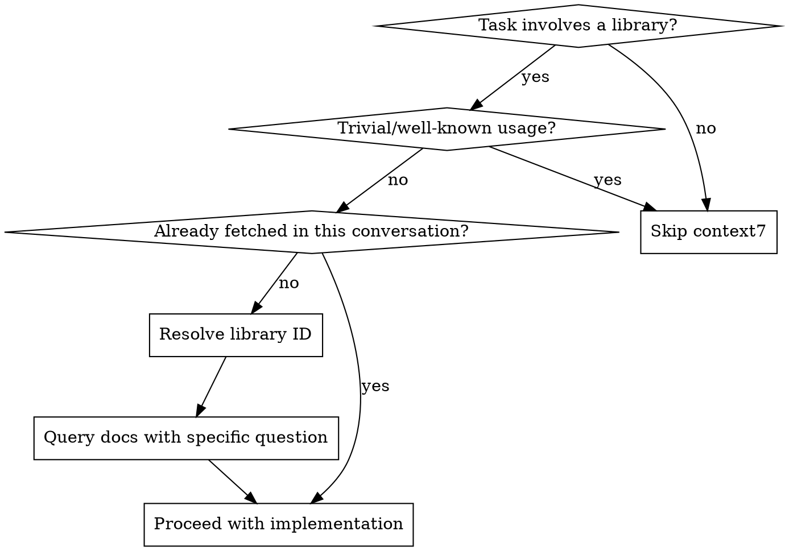

# Using Context7 for Library Documentation

## Overview

Context7 provides up-to-date documentation and code examples for libraries and frameworks via MCP tools. Use it to ground your answers in current docs rather than relying on training data, which may be outdated.

## When to Use

**Fetch docs when:**
- Writing or modifying code that uses non-trivial library APIs (configuration, middleware, hooks, advanced patterns)
- Debugging library-specific issues (wrong API usage, version mismatches, deprecations)
- User asks "how do I do X with library Y?"
- You're uncertain about exact API signatures, options, or behavior
- Working with a library you haven't seen recently or that updates frequently
- Setting up library configuration (webpack, vite, eslint, database drivers, etc.)

**Skip when:**
- Basic, well-known usage (e.g., `useState`, `console.log`, `express.get()`)
- The user has already provided the relevant docs or code examples
- You just fetched docs for this library in the current conversation
- Pure algorithmic or language-level work with no library involvement

## Workflow



### Step 1: Resolve the Library ID

Use `resolve-library-id` to find the Context7-compatible library ID. Be specific:

```
libraryName: "next.js"  (not "next" or "react framework")
query: "server components data fetching"  (your actual question, not generic)
```

Pick the result with the best combination of: name match, high reputation, high snippet count, high benchmark score.

### Step 2: Query Documentation

Use `query-docs` with the resolved library ID. Write a specific query describing what you need:

```
# Good queries - specific and actionable
"How to configure middleware for authentication redirects"
"useEffect cleanup function patterns and gotchas"
"Database connection pooling configuration options"

# Bad queries - too vague
"middleware"
"hooks"
"config"
```

### Step 3: Apply What You Learned

- Use the fetched docs to inform your implementation
- If the docs contradict your training data, trust the docs (they're current)
- Note any version-specific behavior to the user if relevant

## Rules

- **Max 3 calls per question.** If you can't find what you need after 3 context7 calls, use your best available information.
- **Write down key info immediately.** Tool results may be cleared from context later. Capture function signatures, config options, or patterns you'll need.
- **Don't over-fetch.** One well-targeted query beats three vague ones.
- **Combine with codebase reading.** Check the project's existing usage of the library first — context7 supplements, it doesn't replace understanding the current code.

## Multiple Libraries

When a task involves multiple libraries (e.g., "set up Prisma with Next.js API routes"), resolve and query each library's docs independently. Prioritize the library you're least certain about.

## Common Mistakes

| Mistake | Fix |
|---------|-----|
| Querying with vague terms like "config" | Use full question: "How to configure connection pooling with pg" |
| Fetching docs for `Array.map` or `useState` | Skip context7 for standard/basic APIs |
| Not capturing key info from results | Write down signatures and options before they scroll out of context |
| Fetching same library docs repeatedly | Once per conversation per topic is enough |
